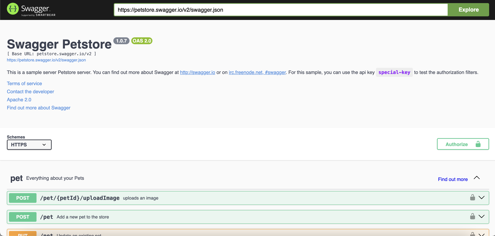

# Проект по тестированию API  <a target="_blank" href="https://petstore.swagger.io//">Petstore</a>

---
### Список проверок, реализованных в автотестах:
1. Создание одного питомца.
2. Поиск питомца по ID.
3. Поиск несуществующего питомца.
4. Поиск всех питомцев по указанному статусу.
5. Удаление питомца.

---

## Используемый стек технологий и инструментов

|                             Python                             |                             Pytest                             |                              Git                               |                                 Jenkins                                 |                                Allure                                 |                             Allure TestOps                             |                                 PyCharm                                  |                             Telegram                             | Requests                                                         |
|:--------------------------------------------------------------:|:--------------------------------------------------------------:|:--------------------------------------------------------------:|:-----------------------------------------------------------------------:|:---------------------------------------------------------------------:|:----------------------------------------------------------------------:|:------------------------------------------------------------------------:|:----------------------------------------------------------------:|------------------------------------------------------------------|
|  |  |  |  |  |  |  |  |  |

##  Запуск проекта в Jenkins
#### Для запуска автотестов в Jenkins
1. __Открыть проект <a href="ссылка">в Jenkins</a>__
2. __Выбрать пункт `Build with Parameters`__
3. __Результат запуска сборки можно посмотреть в отчете Allure__

